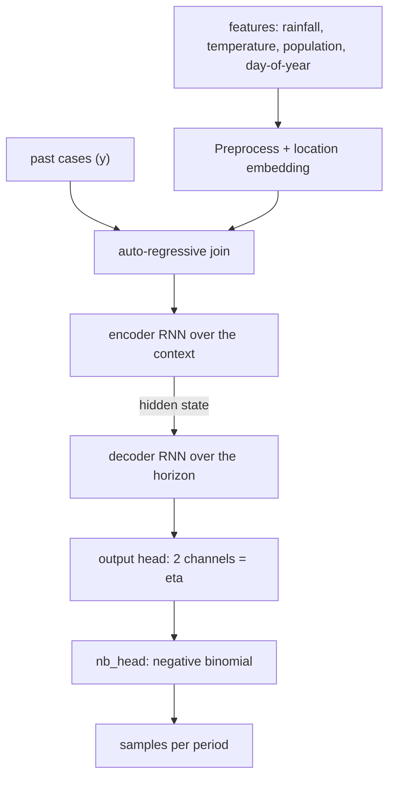

# Concepts

This page explains what regression and auto-regression are, why they fit disease
forecasting, and exactly how `chap_auto_regressive` implements them.

## Regression

**Regression** predicts a numeric outcome from a set of input features. A model
learns a function

```
y ≈ f(x₁, x₂, …, xₙ)
```

from examples, then applies it to new inputs. In disease forecasting the outcome
`y` is the number of cases, and the features might be rainfall, temperature, and
population. Plain regression treats each period independently — it has no notion
that this week follows last week.

## Auto-regression

**Auto-regression** adds the missing ingredient: the series' own past. An
auto-regressive model predicts the next value from earlier values of the *same*
series:

```
yₜ ≈ f(yₜ₋₁, yₜ₋₂, …, yₜ₋k,  external features)
```

The "auto" means *self* — the target is regressed on its own history (the last
`k` periods, the **context**). This matters for disease because case counts are
strongly serially correlated: an outbreak this month makes more cases next month
likely, regardless of climate. A model that ignores recent cases throws that
signal away.

`chap_auto_regressive` is auto-regressive in exactly this sense: when forecasting, it feeds the
recently observed case counts back into the network alongside the climate
covariates.

## Why a *deep* auto-regressive model

A classical auto-regressive model (e.g. ARIMA) assumes a fixed, linear
relationship to a few lagged values. `chap_auto_regressive` instead uses a small **recurrent
neural network (RNN)**, which:

- learns a non-linear function of the history rather than fixed lag coefficients;
- maintains a hidden **state** that summarizes everything seen so far, so it isn't
  limited to a handful of explicit lags;
- shares one set of weights across all locations, while still letting each
  location differ through a learned **embedding**.

## How chap_auto_regressive handles it, step by step

### 1. Inputs and target

For every location and period the model builds a feature vector from:

- `rainfall`
- `mean_temperature`
- `population`
- **day-of-year position** (`day / 365`) — a simple seasonal signal

The target is `disease_cases`. Features are extracted in `transforms.get_series`
and z-scored (mean 0, unit variance) by `transforms.ZScaler` so that no single
feature dominates training.

### 2. Context and horizon

Two settings define the auto-regressive window:

- **`context_length`** — how many past periods the model reads before forecasting
  (12 months for the monthly model, 52 weeks for the weekly one — i.e. about a
  year of history in both).
- **`prediction_length`** — how many periods ahead to forecast (3 and 12
  respectively).

The data loader (`data_loader.py`) slices each location's series into
`(context + horizon)` windows for training.

### 3. The network

The architecture (`rnn_model.ARModel2`) processes a window in stages:

1. **Preprocess** — each location gets a learned embedding (so the model can tell
   regions apart), which is concatenated with the features and passed through a
   small dense layer with dropout.
2. **Auto-regressive join** — the recently observed cases (`y`) are concatenated
   onto the processed features. *This is the auto-regressive step*: the network
   literally sees the series' own past values as input.
3. **Recurrent encoder** — a `SimpleCell` RNN runs over the context window,
   rolling the history up into a hidden state.
4. **Recurrent decoder** — a second `SimpleCell` RNN continues from that state
   across the forecast horizon, where observed cases are no longer available.
5. **Output head** — dense layers emit two numbers per period (`eta`).



Reading the diagram top to bottom: the climate and seasonal **features** are
combined with a learned **location embedding** in *Preprocess*, while the series'
own **past cases** enter separately and are merged at the **auto-regressive
join** — the step that makes the model auto-regressive. The joined sequence runs
through the **encoder RNN** over the context window; its final hidden state seeds
the **decoder RNN**, which steps across the forecast horizon. At each step the
**output head** emits two numbers (`eta`) that `nb_head` turns into a **negative
binomial**, which is **sampled** to produce that period's forecast. Each labelled
box corresponds to one of the five stages listed above.

### 4. From network output to a distribution

Counts are non-negative integers and are typically **overdispersed** (variance
larger than the mean), so a Poisson is too rigid. `chap_auto_regressive` uses a **negative
binomial** instead. The two network outputs are mapped to its parameters by
`distributions.nb_head`:

- channel 0, passed through `softplus`, becomes the count parameter;
- channel 1 becomes the logits.

The wrapper `skip_nan_distribution` makes the likelihood **NaN-tolerant**: missing
observations simply contribute nothing to the loss instead of breaking it.

### 5. Training

Training adjusts the network's weights to fit the data. It is driven by a **loss
function** — a single number that measures how *wrong* the model's predictions
are. Training repeatedly computes the loss, figures out which way to nudge each
weight to lower it (the gradient), and takes a small step; do that enough times
and the model fits.

The choice of loss says what "wrong" means. Here the loss is the **negative
log-likelihood**: for each period the model predicts a whole negative-binomial
*distribution* over case counts, and the likelihood asks "how probable was the
count that actually happened under that distribution?" Putting high probability
on the real value is good, so we take the negative log (good fit → a low number)
and average over periods, weighting the forecast horizon more heavily. A small
L2 penalty on the weights is added to discourage overfitting.

Concretely (`trainer.py`), the `optax` Adam optimizer minimizes this loss for
`n_iter` epochs; because the whole pipeline is written in `jax`, the loss and its
gradients are JIT-compiled. See the [glossary](glossary.md) for the terms used
here.

### 6. Forecasting

At prediction time the model:

1. reads the last `context_length` periods of real history (with observed cases);
2. runs the encoder/decoder forward across the future periods using the supplied
   future climate covariates;
3. draws `num_samples` (default 100) samples from the negative binomial at each
   future period.

The result is a set of sampled trajectories per location — a probabilistic
forecast that CHAP turns into medians and prediction intervals.

## A worked example

Take one location, **Bokeo**, with monthly data. The model reads
`context_length = 12` months of history and forecasts `prediction_length = 3`
months ahead. (The intermediate numbers below are illustrative — the actual
values depend on the trained weights.)

**1. Input — the tail of the history:**

```csv
time_period,rainfall,mean_temperature,disease_cases,population,location
...
2023-10,210.5,25.1,14.0,75049.56,Bokeo
2023-11,180.2,24.3,11.0,75049.56,Bokeo
2023-12,90.7,22.0,7.0,75049.56,Bokeo
```

**2. Each month becomes a feature vector** — the three covariates plus the
day-of-year position of the month's start — then z-scored across the series. For
`2023-12` (day-of-year ≈ 335, so `day_pos = 335/365 ≈ 0.92`):

```
raw      = [rainfall 90.7, mean_temperature 22.0, population 75049.56, day_pos 0.92]
z-scored = [-0.8,          -1.1,                  0.0,                  1.6]
```

(`population` is constant for a location, so its z-score is ~0.)

**3. The window is rolled through the RNN.** The 12 context months — with their
observed cases fed in via the auto-regressive join — go through the encoder; the
decoder then steps across `2024-01 … 2024-03`, where cases are unknown.

**4. Each forecast month's two outputs become a distribution.** Say the head
emits `eta = [1.4, -0.2]` for `2024-01`. `nb_head` turns that into a negative
binomial with `count = softplus(1.4) ≈ 1.6` and `logits = -0.2` — a distribution
centred near 3 cases but with a fat upper tail.

**5. Sampling 100 times produces the output row:**

```csv
time_period,sample_0,sample_1,...,sample_99,location
2024-01,4,2,...,3,Bokeo
```

Sorted, those samples cluster around a **median of ~3**, with most mass in 1–5 and
an occasional 8–10 in the tail. See
[Interpreting the forecast](data.md#interpreting-the-forecast) for turning that
into a point estimate and an interval.

## In one sentence

`chap_auto_regressive` rolls each region's recent case history and climate into an RNN state,
continues that state across the forecast horizon, and reads out a negative
binomial distribution of future cases at each step — auto-regression, done with a
small neural network and a count-appropriate likelihood.
