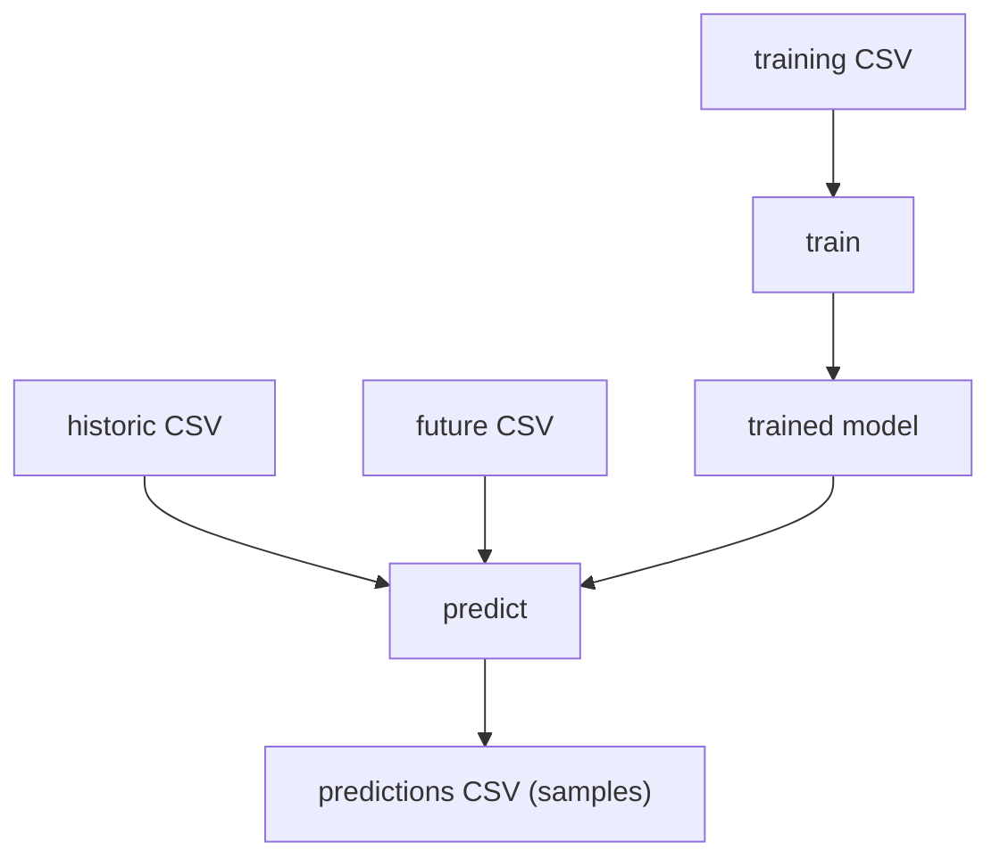

# Data format

This page shows exactly what goes **in** and what comes **out**, with real sample
CSVs. The model speaks CHAP's CSV format: one row per location and time period.



## Input: training data

One row per **location** and **time period**, with the climate covariates, the
population, and the observed target `disease_cases`.

```csv
time_period,rainfall,mean_temperature,disease_cases,population,location
2010-01,37.965,20.04,1.0,75049.56,Bokeo
2010-02,8.527,22.22,1.0,75049.56,Bokeo
2010-03,23.591,24.59,2.0,75049.56,Bokeo
2010-01,12.340,19.81,5.0,1131724.0,Vientiane
2010-02,4.221,21.97,3.0,1131724.0,Vientiane
```

| Column | Meaning |
| --- | --- |
| `time_period` | the period — `YYYY-MM` for monthly, an ISO week range like `2024-12-09/2024-12-15` for weekly |
| `location` | region identifier (name or org-unit id) |
| `rainfall` | covariate — total rainfall in the period |
| `mean_temperature` | covariate — mean temperature in the period |
| `population` | covariate — population of the region |
| `disease_cases` | **target** — observed case count (the thing we learn to predict) |

Notes:

- The three **required covariates** are `rainfall`, `mean_temperature`, and
  `population`. `disease_cases` is the target.
- Each location should be a continuous, equally spaced series (all months, or all
  weeks). The model needs at least `context_length` periods of history.
- Missing `disease_cases` values (gaps in surveillance) are allowed — the
  likelihood skips them rather than failing.

## Input: predicting

Prediction takes **two** files. They have the same columns as above, with one
crucial difference: the future file has no `disease_cases` (that's what we're
forecasting).

**Historic data** — the real past, including observed cases (the model reads the
last `context_length` periods as context):

```csv
time_period,rainfall,mean_temperature,disease_cases,population,location
2023-10,210.5,25.1,14.0,75049.56,Bokeo
2023-11,180.2,24.3,11.0,75049.56,Bokeo
2023-12,90.7,22.0,7.0,75049.56,Bokeo
```

**Future data** — the periods to forecast, with their covariates but **no**
`disease_cases`:

```csv
time_period,rainfall,mean_temperature,population,location
2024-01,40.1,20.5,75049.56,Bokeo
2024-02,12.3,22.1,75049.56,Bokeo
2024-03,25.8,24.7,75049.56,Bokeo
```

## Output: predictions

The forecast is **probabilistic**. For every location and future period the model
emits `num_samples` (default 100) sampled case counts — `sample_0 … sample_99` —
so downstream code can compute a median and prediction intervals.

```csv
time_period,sample_0,sample_1,sample_2,...,sample_99,location
2024-01,4,2,4,...,3,Bokeo
2024-02,7,1,3,...,2,Bokeo
2024-03,4,0,0,...,1,Bokeo
```

(100 sample columns are shown abbreviated as `...`.) Each row is one location at
one future period; the 100 values are draws from the predicted negative-binomial
distribution for that period.

## Interpreting the forecast

Each row is 100 equally likely sampled case counts for one location and period.
Summarize them however your downstream needs — for example with pandas:

```python
import pandas as pd

df = pd.read_csv("predictions.csv")
samples = df.filter(like="sample_")
df["median"] = samples.median(axis=1)
df["lower"] = samples.quantile(0.10, axis=1)
df["upper"] = samples.quantile(0.90, axis=1)
```

- The **median** across the samples is the natural point forecast.
- The gap between **lower** and **upper** is an 80% prediction interval — wide when
  the model is uncertain, narrow when it is confident.
- Because the model uses a negative binomial rather than a Poisson, the samples are
  **overdispersed**: their spread grows with the level, so high-incidence periods
  get appropriately wider intervals instead of a falsely precise one.

When the model runs inside CHAP this summarization is done for you — CHAP reads the
samples and produces the medians and intervals it displays.

## Input vs output at a glance

| | rows | key columns | `disease_cases`? |
| --- | --- | --- | --- |
| **Training input** | location × past period | covariates + `disease_cases` | yes (observed) |
| **Historic input** (predict) | location × past period | covariates + `disease_cases` | yes (observed) |
| **Future input** (predict) | location × future period | covariates only | no |
| **Output** | location × future period | `sample_0 … sample_99` | predicted, as samples |

When run inside CHAP these files are produced and consumed for you — the CLI
adaptor reads/writes them around the model's `train` and `predict`. See
[Usage](usage.md) for the end-to-end commands.
